# Logseq Whiteboard 核心功能架构图

本文档使用 Mermaid 图表展示 Logseq Whiteboard 项目的核心功能框架结构和方案设计。

---

## 1. 系统整体架构图

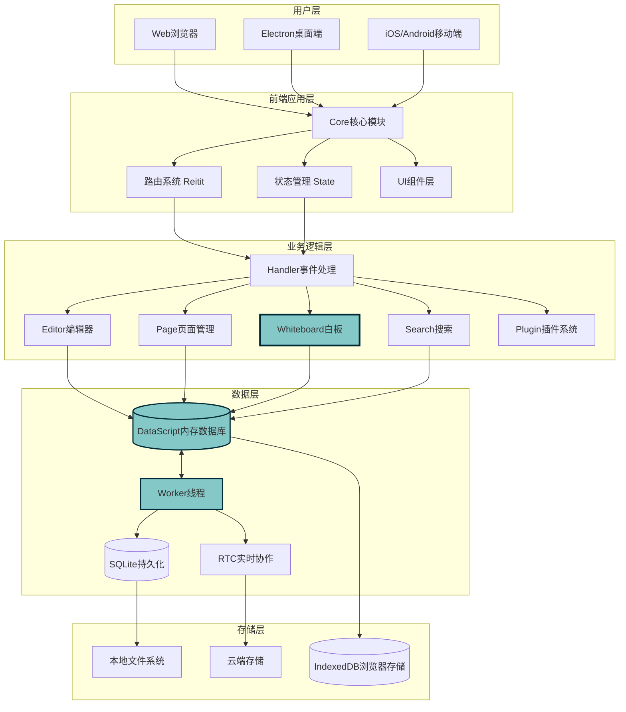
```mermaid
graph TB
    subgraph "用户层"
        Web[Web浏览器]
        Desktop[Electron桌面端]
        Mobile[iOS/Android移动端]
    end
    
    subgraph "前端应用层"
        Core[Core核心模块]
        Router[路由系统 Reitit]
        State[状态管理 State]
        UI[UI组件层]
    end
    
    subgraph "业务逻辑层"
        Handler[Handler事件处理]
        Editor[Editor编辑器]
        Page[Page页面管理]
        Whiteboard[Whiteboard白板]
        Search[Search搜索]
        Plugin[Plugin插件系统]
    end
    
    subgraph "数据层"
        DataScript[(DataScript内存数据库)]
        SQLite[(SQLite持久化)]
        Worker[Worker线程]
        RTC[RTC实时协作]
    end
    
    subgraph "存储层"
        FileSystem[本地文件系统]
        Cloud[云端存储]
        IndexedDB[(IndexedDB浏览器存储)]
    end
    
    Web --> Core
    Desktop --> Core
    Mobile --> Core
    
    Core --> Router
    Core --> State
    Core --> UI
    
    Router --> Handler
    State --> Handler
    
    Handler --> Editor
    Handler --> Page
    Handler --> Whiteboard
    Handler --> Search
    Handler --> Plugin
    
    Editor --> DataScript
    Page --> DataScript
    Whiteboard --> DataScript
    Search --> DataScript
    
    DataScript <--> Worker
    Worker --> SQLite
    Worker --> RTC
    
    DataScript --> IndexedDB
    SQLite --> FileSystem
    RTC --> Cloud
    
    style Whiteboard fill:#85c8c8,stroke:#002b36,stroke-width:3px
    style DataScript fill:#85c8c8,stroke:#002b36,stroke-width:2px
    style Worker fill:#85c8c8,stroke:#002b36,stroke-width:2px
```

---

## 2. 核心功能模块关系图

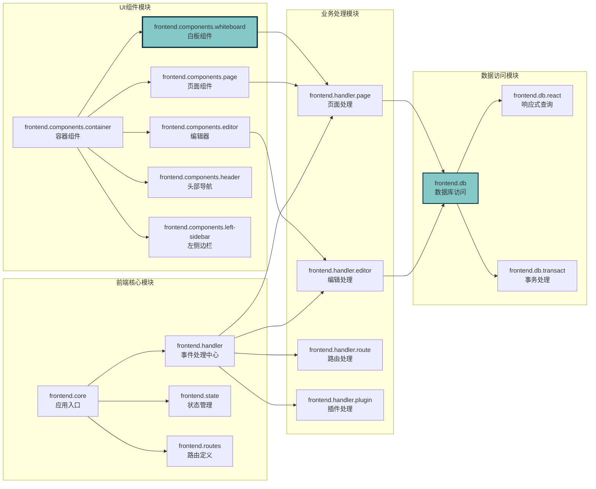
```mermaid
graph LR
    subgraph "前端核心模块"
        A[frontend.core<br/>应用入口]
        B[frontend.handler<br/>事件处理中心]
        C[frontend.state<br/>状态管理]
        D[frontend.routes<br/>路由定义]
    end
    
    subgraph "UI组件模块"
        E[frontend.components.container<br/>容器组件]
        F[frontend.components.editor<br/>编辑器]
        G[frontend.components.page<br/>页面组件]
        H[frontend.components.whiteboard<br/>白板组件]
        I[frontend.components.header<br/>头部导航]
        J[frontend.components.left-sidebar<br/>左侧边栏]
    end
    
    subgraph "业务处理模块"
        K[frontend.handler.editor<br/>编辑处理]
        L[frontend.handler.page<br/>页面处理]
        M[frontend.handler.route<br/>路由处理]
        N[frontend.handler.plugin<br/>插件处理]
    end
    
    subgraph "数据访问模块"
        O[frontend.db<br/>数据库访问]
        P[frontend.db.react<br/>响应式查询]
        Q[frontend.db.transact<br/>事务处理]
    end
    
    A --> B
    A --> C
    A --> D
    
    B --> K
    B --> L
    B --> M
    B --> N
    
    E --> F
    E --> G
    E --> H
    E --> I
    E --> J
    
    F --> K
    G --> L
    H --> L
    
    K --> O
    L --> O
    O --> P
    O --> Q
    
    style H fill:#85c8c8,stroke:#002b36,stroke-width:3px
    style O fill:#85c8c8,stroke:#002b36,stroke-width:2px
```

---

## 3. 数据流架构图

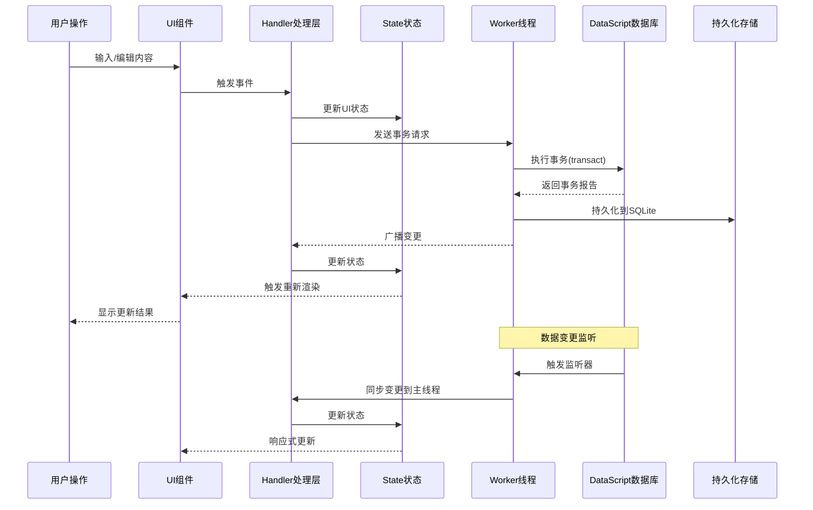
```mermaid
sequenceDiagram
    participant User as 用户操作
    participant UI as UI组件
    participant Handler as Handler处理层
    participant State as State状态
    participant Worker as Worker线程
    participant DB as DataScript数据库
    participant Storage as 持久化存储
    
    User->>UI: 输入/编辑内容
    UI->>Handler: 触发事件
    Handler->>State: 更新UI状态
    Handler->>Worker: 发送事务请求
    Worker->>DB: 执行事务(transact)
    DB-->>Worker: 返回事务报告
    Worker->>Storage: 持久化到SQLite
    Worker-->>Handler: 广播变更
    Handler->>State: 更新状态
    State-->>UI: 触发重新渲染
    UI-->>User: 显示更新结果
    
    Note over Worker,DB: 数据变更监听
    DB->>Worker: 触发监听器
    Worker->>Handler: 同步变更到主线程
    Handler->>State: 更新状态
    State-->>UI: 响应式更新
```

---

## 4. 白板功能架构图

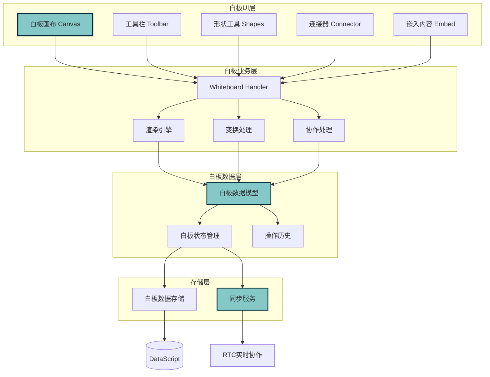
```mermaid
graph TB
    subgraph "白板UI层"
        WB_Canvas[白板画布 Canvas]
        WB_Toolbar[工具栏 Toolbar]
        WB_Shapes[形状工具 Shapes]
        WB_Connector[连接器 Connector]
        WB_Embed[嵌入内容 Embed]
    end
    
    subgraph "白板业务层"
        WB_Handler[Whiteboard Handler]
        WB_Render[渲染引擎]
        WB_Transform[变换处理]
        WB_Collab[协作处理]
    end
    
    subgraph "白板数据层"
        WB_Model[白板数据模型]
        WB_State[白板状态管理]
        WB_History[操作历史]
    end
    
    subgraph "存储层"
        WB_Storage[白板数据存储]
        WB_Sync[同步服务]
    end
    
    WB_Canvas --> WB_Handler
    WB_Toolbar --> WB_Handler
    WB_Shapes --> WB_Handler
    WB_Connector --> WB_Handler
    WB_Embed --> WB_Handler
    
    WB_Handler --> WB_Render
    WB_Handler --> WB_Transform
    WB_Handler --> WB_Collab
    
    WB_Render --> WB_Model
    WB_Transform --> WB_Model
    WB_Collab --> WB_Model
    
    WB_Model --> WB_State
    WB_Model --> WB_History
    
    WB_State --> WB_Storage
    WB_State --> WB_Sync
    
    WB_Storage --> DataScript[(DataScript)]
    WB_Sync --> RTC[RTC实时协作]
    
    style WB_Canvas fill:#85c8c8,stroke:#002b36,stroke-width:3px
    style WB_Model fill:#85c8c8,stroke:#002b36,stroke-width:2px
    style WB_Sync fill:#85c8c8,stroke:#002b36,stroke-width:2px
```

---

## 5. 移动端架构图

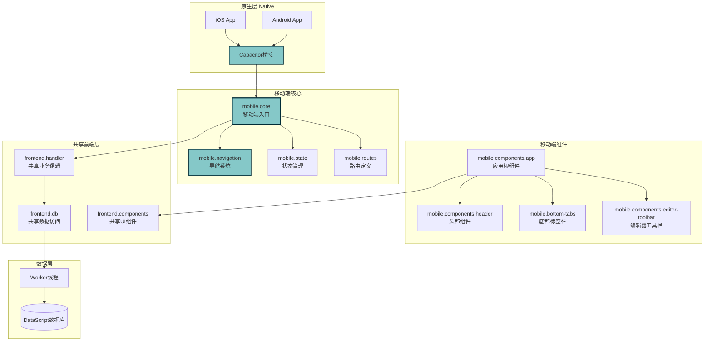
```mermaid
graph TB
    subgraph "原生层 Native"
        iOS[iOS App]
        Android[Android App]
        Capacitor[Capacitor桥接]
    end
    
    subgraph "移动端核心"
        Mobile_Core[mobile.core<br/>移动端入口]
        Mobile_Nav[mobile.navigation<br/>导航系统]
        Mobile_State[mobile.state<br/>状态管理]
        Mobile_Routes[mobile.routes<br/>路由定义]
    end
    
    subgraph "移动端组件"
        Mobile_App[mobile.components.app<br/>应用根组件]
        Mobile_Header[mobile.components.header<br/>头部组件]
        Mobile_Tabs[mobile.bottom-tabs<br/>底部标签栏]
        Mobile_Editor[mobile.components.editor-toolbar<br/>编辑器工具栏]
    end
    
    subgraph "共享前端层"
        Frontend_Handler[frontend.handler<br/>共享业务逻辑]
        Frontend_DB[frontend.db<br/>共享数据访问]
        Frontend_Components[frontend.components<br/>共享UI组件]
    end
    
    subgraph "数据层"
        Worker_Thread[Worker线程]
        DataScript_DB[(DataScript数据库)]
    end
    
    iOS --> Capacitor
    Android --> Capacitor
    Capacitor --> Mobile_Core
    
    Mobile_Core --> Mobile_Nav
    Mobile_Core --> Mobile_State
    Mobile_Core --> Mobile_Routes
    
    Mobile_App --> Mobile_Header
    Mobile_App --> Mobile_Tabs
    Mobile_App --> Mobile_Editor
    
    Mobile_Core --> Frontend_Handler
    Mobile_App --> Frontend_Components
    
    Frontend_Handler --> Frontend_DB
    Frontend_DB --> Worker_Thread
    Worker_Thread --> DataScript_DB
    
    style Mobile_Core fill:#85c8c8,stroke:#002b36,stroke-width:3px
    style Mobile_Nav fill:#85c8c8,stroke:#002b36,stroke-width:2px
    style Capacitor fill:#85c8c8,stroke:#002b36,stroke-width:2px
```

---

## 6. Worker线程架构图

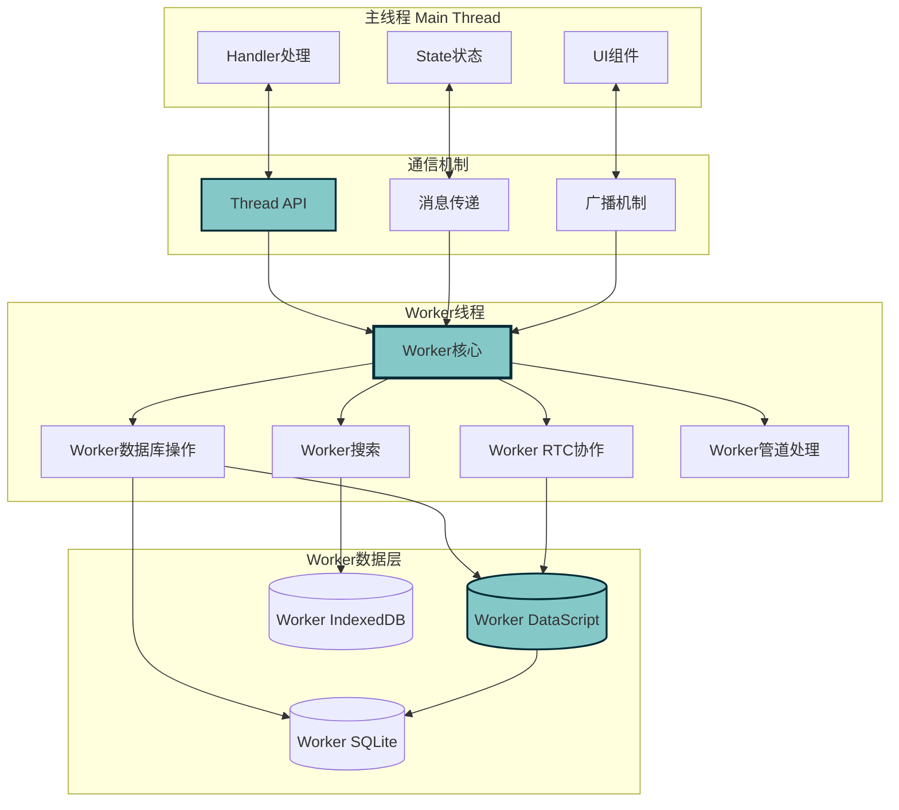
```mermaid
graph TB
    subgraph "主线程 Main Thread"
        Main_Handler[Handler处理]
        Main_State[State状态]
        Main_UI[UI组件]
    end
    
    subgraph "Worker线程"
        Worker_Core[Worker核心]
        Worker_DB[Worker数据库操作]
        Worker_RTC[Worker RTC协作]
        Worker_Search[Worker搜索]
        Worker_Pipeline[Worker管道处理]
    end
    
    subgraph "Worker数据层"
        Worker_DataScript[(Worker DataScript)]
        Worker_SQLite[(Worker SQLite)]
        Worker_IndexedDB[(Worker IndexedDB)]
    end
    
    subgraph "通信机制"
        Thread_API[Thread API]
        Message_Passing[消息传递]
        Broadcast[广播机制]
    end
    
    Main_Handler <--> Thread_API
    Main_State <--> Message_Passing
    Main_UI <--> Broadcast
    
    Thread_API --> Worker_Core
    Message_Passing --> Worker_Core
    Broadcast --> Worker_Core
    
    Worker_Core --> Worker_DB
    Worker_Core --> Worker_RTC
    Worker_Core --> Worker_Search
    Worker_Core --> Worker_Pipeline
    
    Worker_DB --> Worker_DataScript
    Worker_DB --> Worker_SQLite
    Worker_Search --> Worker_IndexedDB
    
    Worker_DataScript --> Worker_SQLite
    Worker_RTC --> Worker_DataScript
    
    style Worker_Core fill:#85c8c8,stroke:#002b36,stroke-width:3px
    style Thread_API fill:#85c8c8,stroke:#002b36,stroke-width:2px
    style Worker_DataScript fill:#85c8c8,stroke:#002b36,stroke-width:2px
```

---

## 7. 路由系统架构图

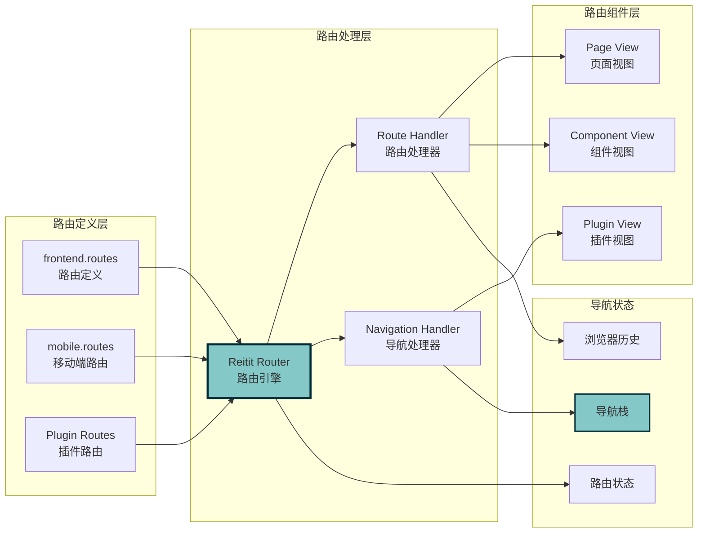
```mermaid
graph LR
    subgraph "路由定义层"
        Routes[frontend.routes<br/>路由定义]
        Mobile_Routes[mobile.routes<br/>移动端路由]
        Plugin_Routes[Plugin Routes<br/>插件路由]
    end
    
    subgraph "路由处理层"
        Router[Reitit Router<br/>路由引擎]
        Route_Handler[Route Handler<br/>路由处理器]
        Nav_Handler[Navigation Handler<br/>导航处理器]
    end
    
    subgraph "路由组件层"
        Page_View[Page View<br/>页面视图]
        Component_View[Component View<br/>组件视图]
        Plugin_View[Plugin View<br/>插件视图]
    end
    
    subgraph "导航状态"
        History[浏览器历史]
        Stack[导航栈]
        State[路由状态]
    end
    
    Routes --> Router
    Mobile_Routes --> Router
    Plugin_Routes --> Router
    
    Router --> Route_Handler
    Router --> Nav_Handler
    
    Route_Handler --> Page_View
    Route_Handler --> Component_View
    Nav_Handler --> Plugin_View
    
    Route_Handler --> History
    Nav_Handler --> Stack
    Router --> State
    
    style Router fill:#85c8c8,stroke:#002b36,stroke-width:3px
    style Stack fill:#85c8c8,stroke:#002b36,stroke-width:2px
```

---

## 8. 插件系统架构图

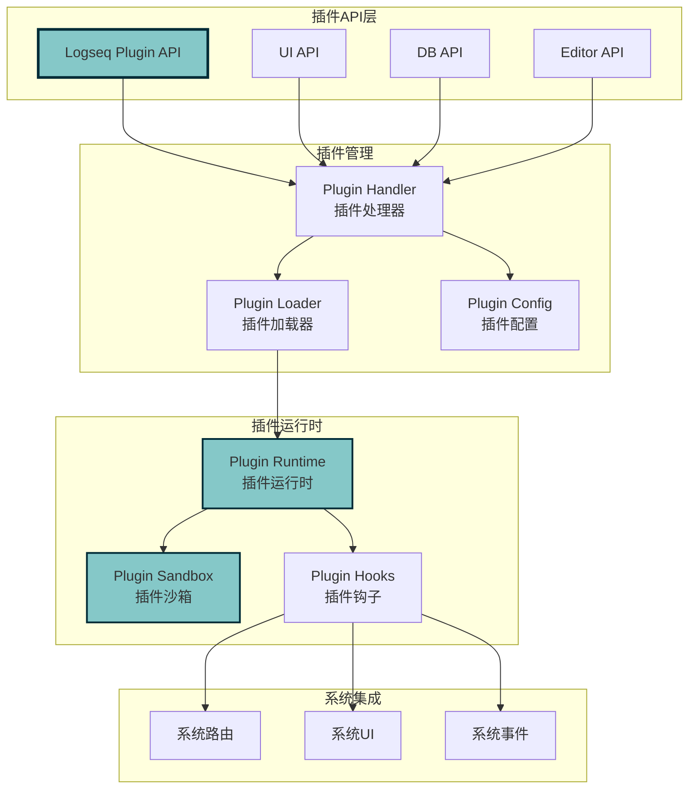
```mermaid
graph TB
    subgraph "插件API层"
        Plugin_API[Logseq Plugin API]
        Plugin_UI[UI API]
        Plugin_DB[DB API]
        Plugin_Editor[Editor API]
    end
    
    subgraph "插件管理"
        Plugin_Handler[Plugin Handler<br/>插件处理器]
        Plugin_Loader[Plugin Loader<br/>插件加载器]
        Plugin_Config[Plugin Config<br/>插件配置]
    end
    
    subgraph "插件运行时"
        Plugin_Runtime[Plugin Runtime<br/>插件运行时]
        Plugin_Sandbox[Plugin Sandbox<br/>插件沙箱]
        Plugin_Hooks[Plugin Hooks<br/>插件钩子]
    end
    
    subgraph "系统集成"
        System_Routes[系统路由]
        System_UI[系统UI]
        System_Events[系统事件]
    end
    
    Plugin_API --> Plugin_Handler
    Plugin_UI --> Plugin_Handler
    Plugin_DB --> Plugin_Handler
    Plugin_Editor --> Plugin_Handler
    
    Plugin_Handler --> Plugin_Loader
    Plugin_Handler --> Plugin_Config
    
    Plugin_Loader --> Plugin_Runtime
    Plugin_Runtime --> Plugin_Sandbox
    Plugin_Runtime --> Plugin_Hooks
    
    Plugin_Hooks --> System_Routes
    Plugin_Hooks --> System_UI
    Plugin_Hooks --> System_Events
    
    style Plugin_API fill:#85c8c8,stroke:#002b36,stroke-width:3px
    style Plugin_Runtime fill:#85c8c8,stroke:#002b36,stroke-width:2px
    style Plugin_Sandbox fill:#85c8c8,stroke:#002b36,stroke-width:2px
```

---

## 9. RTC实时协作架构图

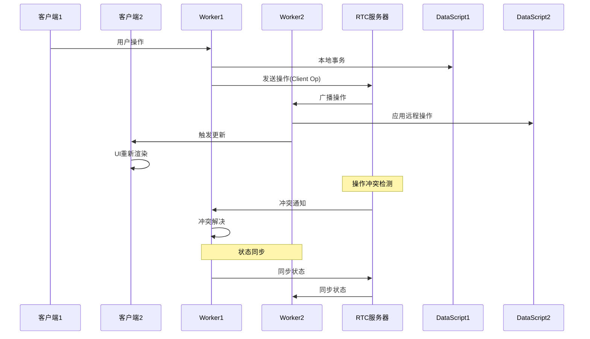
```mermaid
sequenceDiagram
    participant Client1 as 客户端1
    participant Client2 as 客户端2
    participant Worker1 as Worker1
    participant Worker2 as Worker2
    participant RTC_Server as RTC服务器
    participant DB1 as DataScript1
    participant DB2 as DataScript2
    
    Client1->>Worker1: 用户操作
    Worker1->>DB1: 本地事务
    Worker1->>RTC_Server: 发送操作(Client Op)
    RTC_Server->>Worker2: 广播操作
    Worker2->>DB2: 应用远程操作
    Worker2->>Client2: 触发更新
    Client2->>Client2: UI重新渲染
    
    Note over RTC_Server: 操作冲突检测
    RTC_Server->>Worker1: 冲突通知
    Worker1->>Worker1: 冲突解决
    
    Note over Worker1,Worker2: 状态同步
    Worker1->>RTC_Server: 同步状态
    RTC_Server->>Worker2: 同步状态
```

---

## 10. 编辑器架构图

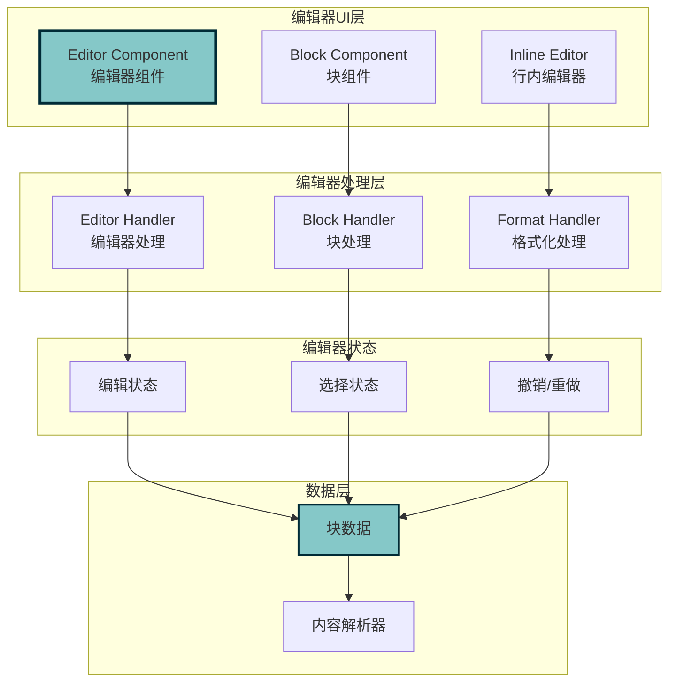
```mermaid
graph TB
    subgraph "编辑器UI层"
        Editor_Component[Editor Component<br/>编辑器组件]
        Block_Component[Block Component<br/>块组件]
        Inline_Editor[Inline Editor<br/>行内编辑器]
    end
    
    subgraph "编辑器处理层"
        Editor_Handler[Editor Handler<br/>编辑器处理]
        Block_Handler[Block Handler<br/>块处理]
        Format_Handler[Format Handler<br/>格式化处理]
    end
    
    subgraph "编辑器状态"
        Edit_State[编辑状态]
        Selection_State[选择状态]
        Undo_Redo[撤销/重做]
    end
    
    subgraph "数据层"
        Block_DB[块数据]
        Content_Parser[内容解析器]
    end
    
    Editor_Component --> Editor_Handler
    Block_Component --> Block_Handler
    Inline_Editor --> Format_Handler
    
    Editor_Handler --> Edit_State
    Block_Handler --> Selection_State
    Format_Handler --> Undo_Redo
    
    Edit_State --> Block_DB
    Selection_State --> Block_DB
    Undo_Redo --> Block_DB
    
    Block_DB --> Content_Parser
    
    style Editor_Component fill:#85c8c8,stroke:#002b36,stroke-width:3px
    style Block_DB fill:#85c8c8,stroke:#002b36,stroke-width:2px
```

---

## 11. 搜索系统架构图

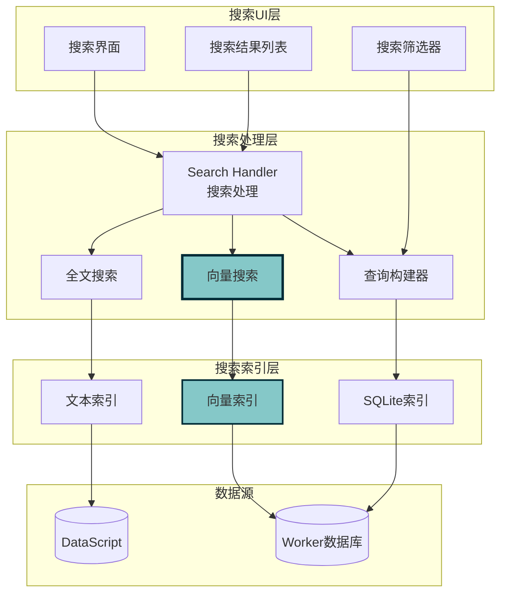
```mermaid
graph TB
    subgraph "搜索UI层"
        Search_UI[搜索界面]
        Search_Results[搜索结果列表]
        Search_Filters[搜索筛选器]
    end
    
    subgraph "搜索处理层"
        Search_Handler[Search Handler<br/>搜索处理]
        FullText_Search[全文搜索]
        Vector_Search[向量搜索]
        Query_Builder[查询构建器]
    end
    
    subgraph "搜索索引层"
        Text_Index[文本索引]
        Vector_Index[向量索引]
        SQLite_Index[SQLite索引]
    end
    
    subgraph "数据源"
        DataScript_DB[(DataScript)]
        Worker_DB[(Worker数据库)]
    end
    
    Search_UI --> Search_Handler
    Search_Results --> Search_Handler
    Search_Filters --> Query_Builder
    
    Search_Handler --> FullText_Search
    Search_Handler --> Vector_Search
    Search_Handler --> Query_Builder
    
    FullText_Search --> Text_Index
    Vector_Search --> Vector_Index
    Query_Builder --> SQLite_Index
    
    Text_Index --> DataScript_DB
    Vector_Index --> Worker_DB
    SQLite_Index --> Worker_DB
    
    style Vector_Search fill:#85c8c8,stroke:#002b36,stroke-width:3px
    style Vector_Index fill:#85c8c8,stroke:#002b36,stroke-width:2px
```

---

## 12. 状态管理架构图

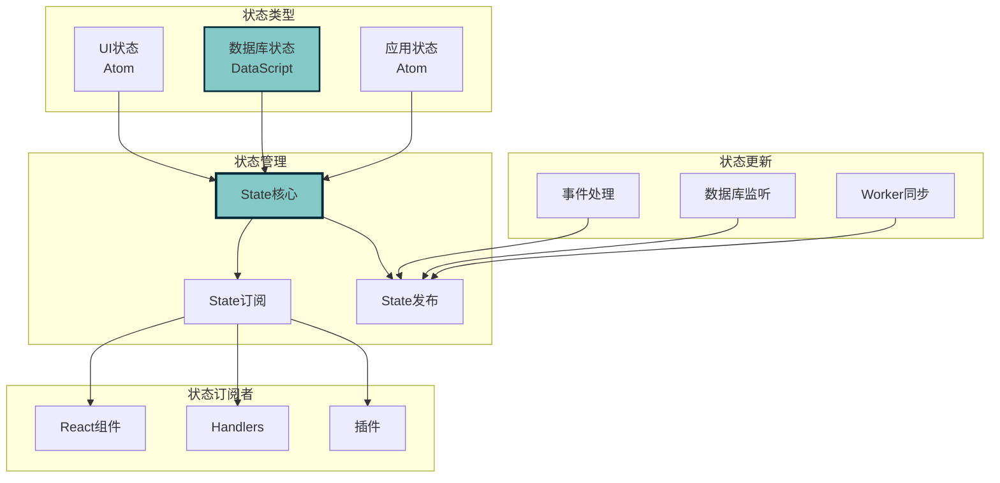
```mermaid
graph TB
    subgraph "状态类型"
        UI_State[UI状态<br/>Atom]
        DB_State[数据库状态<br/>DataScript]
        App_State[应用状态<br/>Atom]
    end
    
    subgraph "状态管理"
        State_Core[State核心]
        State_Sub[State订阅]
        State_Pub[State发布]
    end
    
    subgraph "状态更新"
        Event_Handler[事件处理]
        DB_Listener[数据库监听]
        Worker_Sync[Worker同步]
    end
    
    subgraph "状态订阅者"
        React_Components[React组件]
        Handlers[Handlers]
        Plugins[插件]
    end
    
    UI_State --> State_Core
    DB_State --> State_Core
    App_State --> State_Core
    
    State_Core --> State_Sub
    State_Core --> State_Pub
    
    Event_Handler --> State_Pub
    DB_Listener --> State_Pub
    Worker_Sync --> State_Pub
    
    State_Sub --> React_Components
    State_Sub --> Handlers
    State_Sub --> Plugins
    
    style State_Core fill:#85c8c8,stroke:#002b36,stroke-width:3px
    style DB_State fill:#85c8c8,stroke:#002b36,stroke-width:2px
```

---

## 13. 桌面端主界面设计框架图

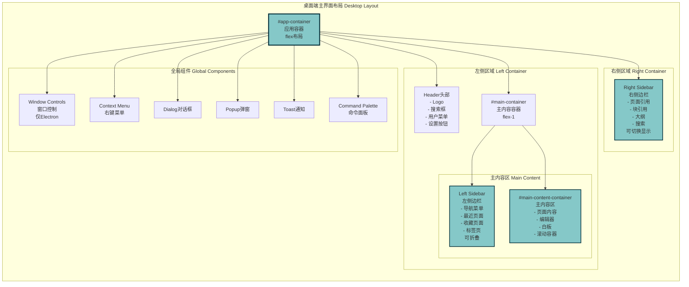
```mermaid
graph TB
    subgraph "桌面端主界面布局 Desktop Layout"
        direction TB
        App_Container["#app-container<br/>应用容器<br/>flex布局"]
        
        subgraph "左侧区域 Left Container"
            direction TB
            Header[Header头部<br/>- Logo<br/>- 搜索框<br/>- 用户菜单<br/>- 设置按钮]
            Main_Container["#main-container<br/>主内容容器<br/>flex-1"]
            
            subgraph "主内容区 Main Content"
                Left_Sidebar["Left Sidebar<br/>左侧边栏<br/>- 导航菜单<br/>- 最近页面<br/>- 收藏页面<br/>- 标签页<br/>可折叠"]
                Main_Content["#main-content-container<br/>主内容区<br/>- 页面内容<br/>- 编辑器<br/>- 白板<br/>- 滚动容器"]
            end
        end
        
        subgraph "右侧区域 Right Container"
            Right_Sidebar["Right Sidebar<br/>右侧边栏<br/>- 页面引用<br/>- 块引用<br/>- 大纲<br/>- 搜索<br/>可切换显示"]
        end
        
        subgraph "全局组件 Global Components"
            Window_Controls[Window Controls<br/>窗口控制<br/>仅Electron]
            Context_Menu[Context Menu<br/>右键菜单]
            Dialog[Dialog对话框]
            Popup[Popup弹窗]
            Toast[Toast通知]
            Command_Palette[Command Palette<br/>命令面板]
        end
    end
    
    App_Container --> Header
    App_Container --> Main_Container
    App_Container --> Right_Sidebar
    App_Container --> Window_Controls
    
    Main_Container --> Left_Sidebar
    Main_Container --> Main_Content
    
    App_Container --> Context_Menu
    App_Container --> Dialog
    App_Container --> Popup
    App_Container --> Toast
    App_Container --> Command_Palette
    
    style App_Container fill:#85c8c8,stroke:#002b36,stroke-width:3px
    style Main_Content fill:#85c8c8,stroke:#002b36,stroke-width:2px
    style Left_Sidebar fill:#85c8c8,stroke:#002b36,stroke-width:2px
    style Right_Sidebar fill:#85c8c8,stroke:#002b36,stroke-width:2px
```

---

## 14. 移动端主界面设计框架图

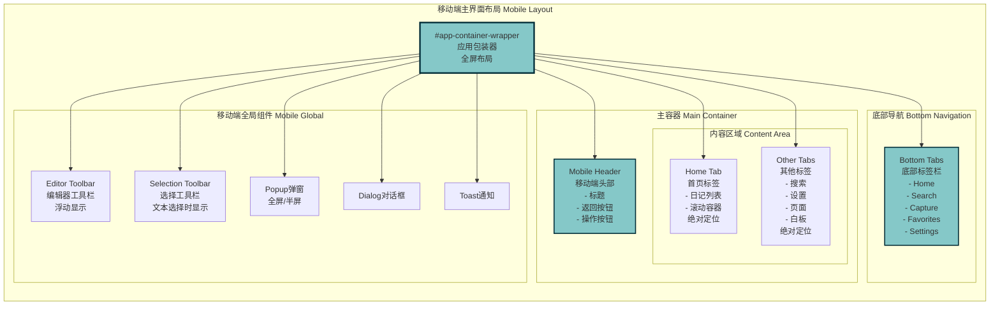
```mermaid
graph TB
    subgraph "移动端主界面布局 Mobile Layout"
        direction TB
        App_Wrapper["#app-container-wrapper<br/>应用包装器<br/>全屏布局"]
        
        subgraph "主容器 Main Container"
            direction TB
            Mobile_Header["Mobile Header<br/>移动端头部<br/>- 标题<br/>- 返回按钮<br/>- 操作按钮"]
            
            subgraph "内容区域 Content Area"
                Home_Tab["Home Tab<br/>首页标签<br/>- 日记列表<br/>- 滚动容器<br/>绝对定位"]
                Other_Tabs["Other Tabs<br/>其他标签<br/>- 搜索<br/>- 设置<br/>- 页面<br/>- 白板<br/>绝对定位"]
            end
        end
        
        subgraph "底部导航 Bottom Navigation"
            Bottom_Tabs["Bottom Tabs<br/>底部标签栏<br/>- Home<br/>- Search<br/>- Capture<br/>- Favorites<br/>- Settings"]
        end
        
        subgraph "移动端全局组件 Mobile Global"
            Editor_Toolbar["Editor Toolbar<br/>编辑器工具栏<br/>浮动显示"]
            Selection_Toolbar["Selection Toolbar<br/>选择工具栏<br/>文本选择时显示"]
            Popup["Popup弹窗<br/>全屏/半屏"]
            Dialog["Dialog对话框"]
            Toast["Toast通知"]
        end
    end
    
    App_Wrapper --> Mobile_Header
    App_Wrapper --> Home_Tab
    App_Wrapper --> Other_Tabs
    App_Wrapper --> Bottom_Tabs
    
    App_Wrapper --> Editor_Toolbar
    App_Wrapper --> Selection_Toolbar
    App_Wrapper --> Popup
    App_Wrapper --> Dialog
    App_Wrapper --> Toast
    
    style App_Wrapper fill:#85c8c8,stroke:#002b36,stroke-width:3px
    style Bottom_Tabs fill:#85c8c8,stroke:#002b36,stroke-width:2px
    style Mobile_Header fill:#85c8c8,stroke:#002b36,stroke-width:2px
```

---

## 15. 主界面组件层级结构图

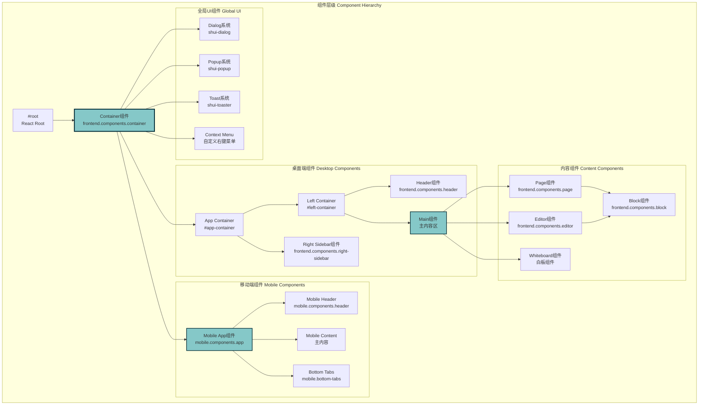
```mermaid
graph TB
    subgraph "组件层级 Component Hierarchy"
        Root["#root<br/>React Root"]
        
        Container["Container组件<br/>frontend.components.container"]
        
        subgraph "桌面端组件 Desktop Components"
            App_Container["App Container<br/>#app-container"]
            Left_Container["Left Container<br/>#left-container"]
            Header_Comp["Header组件<br/>frontend.components.header"]
            Main_Comp["Main组件<br/>主内容区"]
            Right_Sidebar_Comp["Right Sidebar组件<br/>frontend.components.right-sidebar"]
        end
        
        subgraph "移动端组件 Mobile Components"
            Mobile_App["Mobile App组件<br/>mobile.components.app"]
            Mobile_Header_Comp["Mobile Header<br/>mobile.components.header"]
            Mobile_Content["Mobile Content<br/>主内容"]
            Bottom_Tabs_Comp["Bottom Tabs<br/>mobile.bottom-tabs"]
        end
        
        subgraph "内容组件 Content Components"
            Page_Comp["Page组件<br/>frontend.components.page"]
            Editor_Comp["Editor组件<br/>frontend.components.editor"]
            Block_Comp["Block组件<br/>frontend.components.block"]
            Whiteboard_Comp["Whiteboard组件<br/>白板组件"]
        end
        
        subgraph "全局UI组件 Global UI"
            Dialog_System["Dialog系统<br/>shui-dialog"]
            Popup_System["Popup系统<br/>shui-popup"]
            Toast_System["Toast系统<br/>shui-toaster"]
            Context_Menu_System["Context Menu<br/>自定义右键菜单"]
        end
    end
    
    Root --> Container
    
    Container --> App_Container
    Container --> Mobile_App
    
    App_Container --> Left_Container
    App_Container --> Right_Sidebar_Comp
    
    Left_Container --> Header_Comp
    Left_Container --> Main_Comp
    
    Mobile_App --> Mobile_Header_Comp
    Mobile_App --> Mobile_Content
    Mobile_App --> Bottom_Tabs_Comp
    
    Main_Comp --> Page_Comp
    Main_Comp --> Editor_Comp
    Main_Comp --> Whiteboard_Comp
    
    Page_Comp --> Block_Comp
    Editor_Comp --> Block_Comp
    
    Container --> Dialog_System
    Container --> Popup_System
    Container --> Toast_System
    Container --> Context_Menu_System
    
    style Container fill:#85c8c8,stroke:#002b36,stroke-width:3px
    style Main_Comp fill:#85c8c8,stroke:#002b36,stroke-width:2px
    style Mobile_App fill:#85c8c8,stroke:#002b36,stroke-width:2px
```

---

## 16. 主界面布局响应式设计图

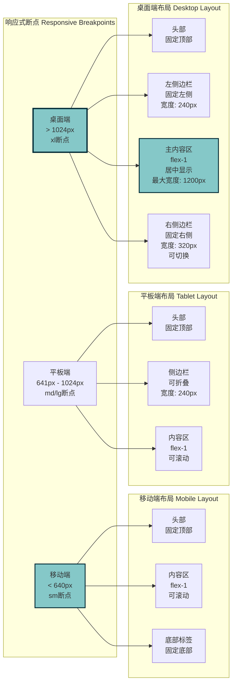
```mermaid
graph LR
    subgraph "响应式断点 Responsive Breakpoints"
        Mobile["移动端<br/>< 640px<br/>sm断点"]
        Tablet["平板端<br/>641px - 1024px<br/>md/lg断点"]
        Desktop["桌面端<br/>> 1024px<br/>xl断点"]
    end
    
    subgraph "移动端布局 Mobile Layout"
        M_Header[头部<br/>固定顶部]
        M_Content[内容区<br/>flex-1<br/>可滚动]
        M_Tabs[底部标签<br/>固定底部]
    end
    
    subgraph "平板端布局 Tablet Layout"
        T_Header[头部<br/>固定顶部]
        T_Sidebar[侧边栏<br/>可折叠<br/>宽度: 240px]
        T_Content[内容区<br/>flex-1<br/>可滚动]
    end
    
    subgraph "桌面端布局 Desktop Layout"
        D_Header[头部<br/>固定顶部]
        D_LeftSidebar[左侧边栏<br/>固定左侧<br/>宽度: 240px]
        D_Content[主内容区<br/>flex-1<br/>居中显示<br/>最大宽度: 1200px]
        D_RightSidebar[右侧边栏<br/>固定右侧<br/>宽度: 320px<br/>可切换]
    end
    
    Mobile --> M_Header
    Mobile --> M_Content
    Mobile --> M_Tabs
    
    Tablet --> T_Header
    Tablet --> T_Sidebar
    Tablet --> T_Content
    
    Desktop --> D_Header
    Desktop --> D_LeftSidebar
    Desktop --> D_Content
    Desktop --> D_RightSidebar
    
    style Mobile fill:#85c8c8,stroke:#002b36,stroke-width:2px
    style Desktop fill:#85c8c8,stroke:#002b36,stroke-width:3px
    style D_Content fill:#85c8c8,stroke:#002b36,stroke-width:2px
```

---

## 17. 主界面交互流程图

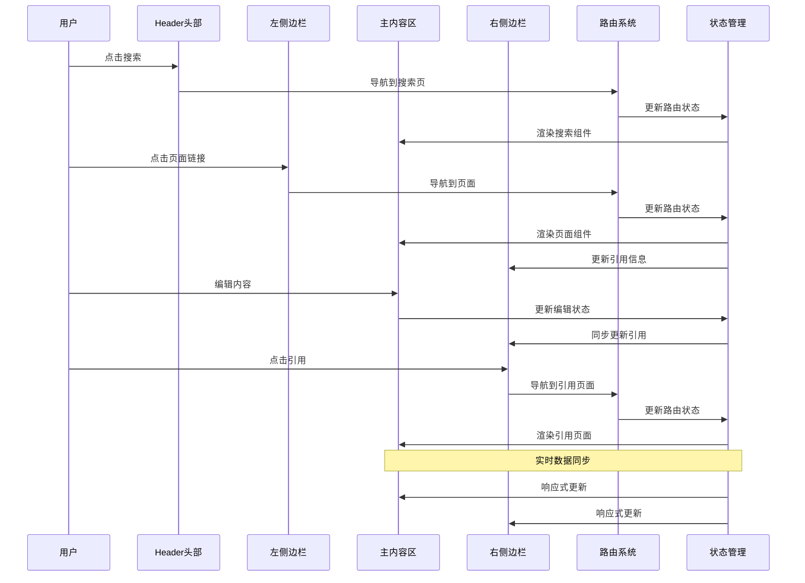
```mermaid
sequenceDiagram
    participant User as 用户
    participant Header as Header头部
    participant LeftSidebar as 左侧边栏
    participant MainContent as 主内容区
    participant RightSidebar as 右侧边栏
    participant Router as 路由系统
    participant State as 状态管理
    
    User->>Header: 点击搜索
    Header->>Router: 导航到搜索页
    Router->>State: 更新路由状态
    State->>MainContent: 渲染搜索组件
    
    User->>LeftSidebar: 点击页面链接
    LeftSidebar->>Router: 导航到页面
    Router->>State: 更新路由状态
    State->>MainContent: 渲染页面组件
    State->>RightSidebar: 更新引用信息
    
    User->>MainContent: 编辑内容
    MainContent->>State: 更新编辑状态
    State->>RightSidebar: 同步更新引用
    
    User->>RightSidebar: 点击引用
    RightSidebar->>Router: 导航到引用页面
    Router->>State: 更新路由状态
    State->>MainContent: 渲染引用页面
    
    Note over MainContent,State: 实时数据同步
    State->>MainContent: 响应式更新
    State->>RightSidebar: 响应式更新
```

---

## 18. 主界面样式系统图

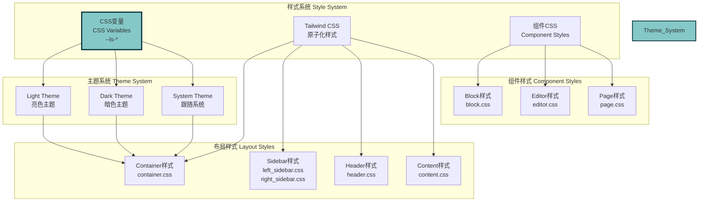
```mermaid
graph TB
    subgraph "样式系统 Style System"
        CSS_Vars["CSS变量<br/>CSS Variables<br/>--ls-*"]
        Tailwind["Tailwind CSS<br/>原子化样式"]
        Component_CSS["组件CSS<br/>Component Styles"]
    end
    
    subgraph "主题系统 Theme System"
        Light_Theme["Light Theme<br/>亮色主题"]
        Dark_Theme["Dark Theme<br/>暗色主题"]
        System_Theme["System Theme<br/>跟随系统"]
    end
    
    subgraph "布局样式 Layout Styles"
        Container_Styles["Container样式<br/>container.css"]
        Sidebar_Styles["Sidebar样式<br/>left_sidebar.css<br/>right_sidebar.css"]
        Header_Styles["Header样式<br/>header.css"]
        Content_Styles["Content样式<br/>content.css"]
    end
    
    subgraph "组件样式 Component Styles"
        Block_Styles["Block样式<br/>block.css"]
        Editor_Styles["Editor样式<br/>editor.css"]
        Page_Styles["Page样式<br/>page.css"]
    end
    
    CSS_Vars --> Light_Theme
    CSS_Vars --> Dark_Theme
    CSS_Vars --> System_Theme
    
    Tailwind --> Container_Styles
    Tailwind --> Sidebar_Styles
    Tailwind --> Header_Styles
    Tailwind --> Content_Styles
    
    Component_CSS --> Block_Styles
    Component_CSS --> Editor_Styles
    Component_CSS --> Page_Styles
    
    Light_Theme --> Container_Styles
    Dark_Theme --> Container_Styles
    System_Theme --> Container_Styles
    
    style CSS_Vars fill:#85c8c8,stroke:#002b36,stroke-width:3px
    style Theme_System fill:#85c8c8,stroke:#002b36,stroke-width:2px
```

---

## 19. Journals（日记）功能架构图

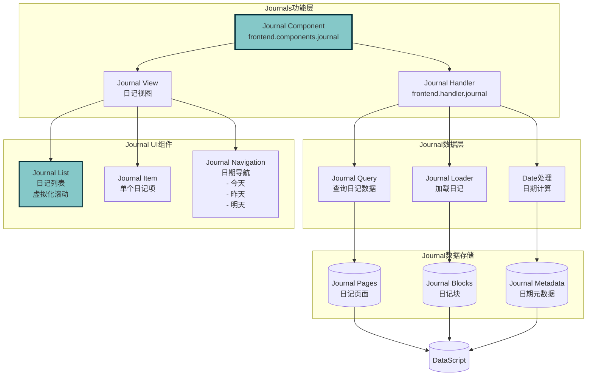
```mermaid
graph TB
    subgraph "Journals功能层"
        Journal_Component[Journal Component<br/>frontend.components.journal]
        Journal_Handler[Journal Handler<br/>frontend.handler.journal]
        Journal_View[Journal View<br/>日记视图]
    end
    
    subgraph "Journal数据层"
        Journal_Query[Journal Query<br/>查询日记数据]
        Journal_Loader[Journal Loader<br/>加载日记]
        Journal_Date[Date处理<br/>日期计算]
    end
    
    subgraph "Journal UI组件"
        Journal_List[Journal List<br/>日记列表<br/>虚拟化滚动]
        Journal_Item[Journal Item<br/>单个日记项]
        Journal_Navigation[Journal Navigation<br/>日期导航<br/>- 今天<br/>- 昨天<br/>- 明天]
    end
    
    subgraph "Journal数据存储"
        Journal_Pages[(Journal Pages<br/>日记页面)]
        Journal_Blocks[(Journal Blocks<br/>日记块)]
        Journal_Metadata[(Journal Metadata<br/>日期元数据)]
    end
    
    Journal_Component --> Journal_Handler
    Journal_Component --> Journal_View
    
    Journal_Handler --> Journal_Query
    Journal_Handler --> Journal_Date
    Journal_Handler --> Journal_Loader
    
    Journal_View --> Journal_List
    Journal_View --> Journal_Item
    Journal_View --> Journal_Navigation
    
    Journal_Query --> Journal_Pages
    Journal_Loader --> Journal_Blocks
    Journal_Date --> Journal_Metadata
    
    Journal_Pages --> DataScript[(DataScript)]
    Journal_Blocks --> DataScript
    Journal_Metadata --> DataScript
    
    style Journal_Component fill:#85c8c8,stroke:#002b36,stroke-width:3px
    style Journal_List fill:#85c8c8,stroke:#002b36,stroke-width:2px
```

---

## 20. Pages（页面）功能架构图

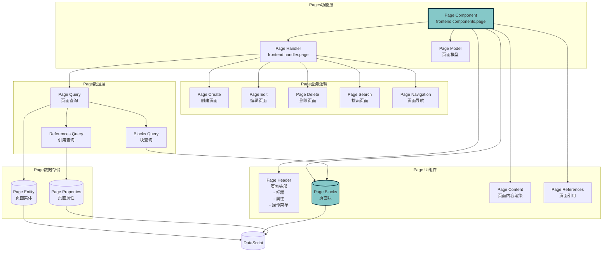
```mermaid
graph TB
    subgraph "Pages功能层"
        Page_Component[Page Component<br/>frontend.components.page]
        Page_Handler[Page Handler<br/>frontend.handler.page]
        Page_Model[Page Model<br/>页面模型]
    end
    
    subgraph "Page UI组件"
        Page_Header[Page Header<br/>页面头部<br/>- 标题<br/>- 属性<br/>- 操作菜单]
        Page_Blocks[Page Blocks<br/>页面块列表]
        Page_Content[Page Content<br/>页面内容渲染]
        Page_References[Page References<br/>页面引用]
    end
    
    subgraph "Page业务逻辑"
        Page_Create[Page Create<br/>创建页面]
        Page_Edit[Page Edit<br/>编辑页面]
        Page_Delete[Page Delete<br/>删除页面]
        Page_Search[Page Search<br/>搜索页面]
        Page_Navigation[Page Navigation<br/>页面导航]
    end
    
    subgraph "Page数据层"
        Page_Query[Page Query<br/>页面查询]
        Page_Blocks_Query[Blocks Query<br/>块查询]
        Page_Refs_Query[References Query<br/>引用查询]
    end
    
    subgraph "Page数据存储"
        Page_Entity[(Page Entity<br/>页面实体)]
        Page_Blocks[(Page Blocks<br/>页面块)]
        Page_Properties[(Page Properties<br/>页面属性)]
    end
    
    Page_Component --> Page_Handler
    Page_Component --> Page_Model
    
    Page_Component --> Page_Header
    Page_Component --> Page_Blocks
    Page_Component --> Page_Content
    Page_Component --> Page_References
    
    Page_Handler --> Page_Create
    Page_Handler --> Page_Edit
    Page_Handler --> Page_Delete
    Page_Handler --> Page_Search
    Page_Handler --> Page_Navigation
    
    Page_Handler --> Page_Query
    Page_Query --> Page_Blocks_Query
    Page_Query --> Page_Refs_Query
    
    Page_Query --> Page_Entity
    Page_Blocks_Query --> Page_Blocks
    Page_Refs_Query --> Page_Properties
    
    Page_Entity --> DataScript[(DataScript)]
    Page_Blocks --> DataScript
    Page_Properties --> DataScript
    
    style Page_Component fill:#85c8c8,stroke:#002b36,stroke-width:3px
    style Page_Blocks fill:#85c8c8,stroke:#002b36,stroke-width:2px
```

---

## 21. Graph（知识图谱）功能架构图

```mermaid
graph TB
    subgraph "Graph功能层"
        Graph_Component[Graph Component<br/>frontend.extensions.graph]
        Graph_Handler[Graph Handler<br/>frontend.handler.graph]
        Graph_View[Graph View<br/>frontend.common.graph-view]
    end
    
    subgraph "Graph渲染层"
        Graph_Renderer[Graph Renderer<br/>Pixi.js渲染器]
        Graph_Layout[Graph Layout<br/>D3 Force布局]
        Graph_Interaction[Graph Interaction<br/>交互处理]
    end
    
    subgraph "Graph数据层"
        Graph_Builder[Graph Builder<br/>构建图谱数据]
        Graph_Query[Graph Query<br/>查询节点和链接]
        Graph_Filter[Graph Filter<br/>图谱筛选]
    end
    
    subgraph "Graph类型"
        Global_Graph[Global Graph<br/>全局图谱<br/>所有页面]
        Page_Graph[Page Graph<br/>页面图谱<br/>单页面关系]
        Block_Graph[Block Graph<br/>块图谱<br/>块引用关系]
    end
    
    subgraph "Graph数据"
        Graph_Nodes[(Graph Nodes<br/>节点数据)]
        Graph_Links[(Graph Links<br/>链接数据)]
        Graph_Forces[(Force Settings<br/>力导向设置)]
    end
    
    Graph_Component --> Graph_Handler
    Graph_Component --> Graph_View
    
    Graph_Component --> Graph_Renderer
    Graph_Renderer --> Graph_Layout
    Graph_Renderer --> Graph_Interaction
    
    Graph_View --> Graph_Builder
    Graph_Builder --> Graph_Query
    Graph_Query --> Graph_Filter
    
    Graph_Builder --> Global_Graph
    Graph_Builder --> Page_Graph
    Graph_Builder --> Block_Graph
    
    Graph_Query --> Graph_Nodes
    Graph_Query --> Graph_Links
    Graph_Layout --> Graph_Forces
    
    Graph_Nodes --> DataScript[(DataScript)]
    Graph_Links --> DataScript
    
    style Graph_Component fill:#85c8c8,stroke:#002b36,stroke-width:3px
    style Graph_Renderer fill:#85c8c8,stroke:#002b36,stroke-width:2px
    style Graph_Layout fill:#85c8c8,stroke:#002b36,stroke-width:2px
```

---

## 22. Todos（待办事项）功能架构图

```mermaid
graph TB
    subgraph "Todos功能层"
        Todo_Component[Todo Component<br/>任务组件]
        Todo_Handler[Todo Handler<br/>任务处理]
        Todo_Query[Todo Query<br/>任务查询]
    end
    
    subgraph "Todo状态管理"
        Todo_Status[Todo Status<br/>任务状态<br/>- TODO<br/>- DOING<br/>- DONE]
        Todo_Priority[Todo Priority<br/>任务优先级<br/>- A/B/C]
        Todo_Schedule[Todo Schedule<br/>任务调度<br/>- Scheduled<br/>- Deadline]
    end
    
    subgraph "Todo UI组件"
        Todo_Marker[Todo Marker<br/>任务标记<br/>- TODO<br/>- DOING<br/>- DONE]
        Todo_List[Todo List<br/>任务列表]
        Todo_Filter[Todo Filter<br/>任务筛选]
        Todo_Query_View[Query View<br/>查询视图]
    end
    
    subgraph "Todo业务逻辑"
        Todo_Create[Todo Create<br/>创建任务]
        Todo_Update[Todo Update<br/>更新任务]
        Todo_Complete[Todo Complete<br/>完成任务]
        Todo_Repeat[Todo Repeat<br/>重复任务]
        Todo_Command[Todo Command<br/>任务命令<br/>自动处理]
    end
    
    subgraph "Todo数据层"
        Todo_Query_DSL[Query DSL<br/>查询语言<br/>task/todo查询]
        Todo_Property[Todo Property<br/>任务属性]
        Todo_Class[Todo Class<br/>任务类<br/>logseq.class/Todo]
    end
    
    subgraph "Todo数据存储"
        Todo_Blocks[(Todo Blocks<br/>任务块)]
        Todo_Properties[(Todo Properties<br/>任务属性)]
        Todo_Metadata[(Todo Metadata<br/>任务元数据)]
    end
    
    Todo_Component --> Todo_Handler
    Todo_Handler --> Todo_Query
    
    Todo_Component --> Todo_Marker
    Todo_Component --> Todo_List
    Todo_Component --> Todo_Filter
    Todo_Component --> Todo_Query_View
    
    Todo_Handler --> Todo_Create
    Todo_Handler --> Todo_Update
    Todo_Handler --> Todo_Complete
    Todo_Handler --> Todo_Repeat
    Todo_Handler --> Todo_Command
    
    Todo_Status --> Todo_Property
    Todo_Priority --> Todo_Property
    Todo_Schedule --> Todo_Property
    
    Todo_Query --> Todo_Query_DSL
    Todo_Query_DSL --> Todo_Class
    Todo_Property --> Todo_Class
    
    Todo_Query --> Todo_Blocks
    Todo_Property --> Todo_Properties
    Todo_Command --> Todo_Metadata
    
    Todo_Blocks --> DataScript[(DataScript)]
    Todo_Properties --> DataScript
    Todo_Metadata --> DataScript
    
    style Todo_Component fill:#85c8c8,stroke:#002b36,stroke-width:3px
    style Todo_Query fill:#85c8c8,stroke:#002b36,stroke-width:2px
    style Todo_Command fill:#85c8c8,stroke:#002b36,stroke-width:2px
```

---

## 23. Whiteboard（白板）详细架构图

```mermaid
graph TB
    subgraph "Whiteboard功能层"
        WB_Component[Whiteboard Component<br/>白板组件]
        WB_Handler[Whiteboard Handler<br/>白板处理]
        WB_State[Whiteboard State<br/>白板状态管理]
    end
    
    subgraph "Whiteboard画布层"
        WB_Canvas[Whiteboard Canvas<br/>画布容器]
        WB_Renderer[Canvas Renderer<br/>画布渲染器]
        WB_Transform[Transform Engine<br/>变换引擎<br/>- 缩放<br/>- 平移<br/>- 旋转]
    end
    
    subgraph "Whiteboard工具"
        WB_Toolbar[Toolbar<br/>工具栏]
        WB_Shapes[Shape Tools<br/>形状工具<br/>- 矩形<br/>- 圆形<br/>- 箭头]
        WB_Draw[Draw Tool<br/>绘图工具]
        WB_Text[Text Tool<br/>文本工具]
        WB_Embed[Embed Tool<br/>嵌入工具<br/>- 页面<br/>- 媒体<br/>- 链接]
        WB_Connector[Connector Tool<br/>连接器工具]
    end
    
    subgraph "Whiteboard对象"
        WB_Objects[Whiteboard Objects<br/>白板对象]
        WB_Selection[Selection<br/>选择系统]
        WB_Layers[Layers<br/>图层管理]
    end
    
    subgraph "Whiteboard数据层"
        WB_Model[Whiteboard Model<br/>白板数据模型]
        WB_Serializer[Serializer<br/>序列化/反序列化]
        WB_History[History<br/>操作历史<br/>撤销/重做]
    end
    
    subgraph "Whiteboard协作"
        WB_RTC[RTC Sync<br/>实时同步]
        WB_Conflict[Conflict Resolution<br/>冲突解决]
        WB_Presence[Presence<br/>在线状态]
    end
    
    subgraph "Whiteboard存储"
        WB_Data[(Whiteboard Data<br/>白板数据)]
        WB_Assets[(Whiteboard Assets<br/>白板资源)]
    end
    
    WB_Component --> WB_Handler
    WB_Component --> WB_State
    
    WB_Component --> WB_Canvas
    WB_Canvas --> WB_Renderer
    WB_Renderer --> WB_Transform
    
    WB_Component --> WB_Toolbar
    WB_Toolbar --> WB_Shapes
    WB_Toolbar --> WB_Draw
    WB_Toolbar --> WB_Text
    WB_Toolbar --> WB_Embed
    WB_Toolbar --> WB_Connector
    
    WB_Canvas --> WB_Objects
    WB_Objects --> WB_Selection
    WB_Objects --> WB_Layers
    
    WB_Handler --> WB_Model
    WB_Model --> WB_Serializer
    WB_Model --> WB_History
    
    WB_Handler --> WB_RTC
    WB_RTC --> WB_Conflict
    WB_RTC --> WB_Presence
    
    WB_Model --> WB_Data
    WB_Embed --> WB_Assets
    
    WB_Data --> DataScript[(DataScript)]
    WB_Assets --> DataScript
    
    style WB_Component fill:#85c8c8,stroke:#002b36,stroke-width:3px
    style WB_Canvas fill:#85c8c8,stroke:#002b36,stroke-width:2px
    style WB_RTC fill:#85c8c8,stroke:#002b36,stroke-width:2px
```

---

## 24. 核心功能数据流图

```mermaid
sequenceDiagram
    participant User as 用户
    participant Journal as Journals
    participant Page as Pages
    participant Graph as Graph
    participant Todo as Todos
    participant Whiteboard as Whiteboard
    participant Handler as Handler
    participant DB as DataScript
    participant Worker as Worker
    
    User->>Journal: 创建日记
    Journal->>Handler: 创建日记页面
    Handler->>Worker: 发送事务
    Worker->>DB: 保存日记数据
    DB-->>Graph: 更新图谱节点
    DB-->>Page: 更新页面列表
    
    User->>Page: 创建页面
    Page->>Handler: 创建页面
    Handler->>Worker: 发送事务
    Worker->>DB: 保存页面数据
    DB-->>Graph: 更新图谱
    DB-->>Page: 更新引用
    
    User->>Todo: 创建任务
    Todo->>Handler: 创建任务块
    Handler->>Worker: 发送事务
    Worker->>DB: 保存任务数据
    DB-->>Todo: 更新任务列表
    DB-->>Page: 更新页面任务
    
    User->>Whiteboard: 在白板中操作
    Whiteboard->>Handler: 更新白板数据
    Handler->>Worker: 发送事务
    Worker->>DB: 保存白板数据
    Worker->>RTC: 同步到其他客户端
    DB-->>Whiteboard: 更新白板视图
    
    User->>Graph: 查看知识图谱
    Graph->>DB: 查询页面关系
    DB-->>Graph: 返回节点和链接
    Graph->>Graph: 渲染图谱
```

---

## 25. 核心功能关系图

```mermaid
graph TB
    subgraph "核心功能 Core Features"
        Journals[Journals<br/>日记]
        Pages[Pages<br/>页面]
        Graph[Graph<br/>知识图谱]
        Todos[Todos<br/>待办事项]
        Whiteboard[Whiteboard<br/>白板]
    end
    
    subgraph "数据层 Data Layer"
        Blocks[Blocks<br/>块系统]
        References[References<br/>引用系统]
        Properties[Properties<br/>属性系统]
    end
    
    subgraph "存储层 Storage"
        DataScript[(DataScript<br/>内存数据库)]
    end
    
    Journals --> Blocks
    Pages --> Blocks
    Todos --> Blocks
    Whiteboard --> Blocks
    
    Journals --> References
    Pages --> References
    Todos --> References
    Whiteboard --> References
    
    Pages --> Properties
    Todos --> Properties
    Whiteboard --> Properties
    
    Graph --> Pages
    Graph --> References
    
    Blocks --> DataScript
    References --> DataScript
    Properties --> DataScript
    
    style Journals fill:#85c8c8,stroke:#002b36,stroke-width:2px
    style Pages fill:#85c8c8,stroke:#002b36,stroke-width:2px
    style Graph fill:#85c8c8,stroke:#002b36,stroke-width:2px
    style Todos fill:#85c8c8,stroke:#002b36,stroke-width:2px
    style Whiteboard fill:#85c8c8,stroke:#002b36,stroke-width:3px
```

---

## 图表说明

### 颜色说明
- **深青色 (#85c8c8)**: 核心模块和关键组件
- **深色边框 (#002b36)**: 重要模块边界

### 图表类型
1. **系统整体架构图**: 展示从用户层到存储层的完整架构
2. **核心功能模块关系图**: 展示各模块之间的依赖关系
3. **数据流架构图**: 展示数据在系统中的流转过程
4. **白板功能架构图**: 专门展示白板功能的内部架构
5. **移动端架构图**: 展示移动端的特殊架构设计
6. **Worker线程架构图**: 展示Worker线程的架构
7. **路由系统架构图**: 展示路由系统的设计
8. **插件系统架构图**: 展示插件系统的架构
9. **RTC实时协作架构图**: 展示实时协作的流程
10. **编辑器架构图**: 展示编辑器的内部架构
11. **搜索系统架构图**: 展示搜索功能的架构
12. **状态管理架构图**: 展示状态管理的设计

### 使用建议

1. **在Markdown查看器中查看**: 这些Mermaid图表可以在支持Mermaid的Markdown查看器中直接渲染
2. **在GitHub中查看**: GitHub原生支持Mermaid图表
3. **导出为图片**: 可以使用Mermaid Live Editor (https://mermaid.live) 导出为PNG/SVG
4. **集成到文档**: 可以将这些图表集成到项目文档中

---

**文档版本**: 1.0  
**最后更新**: 2026-01-23
